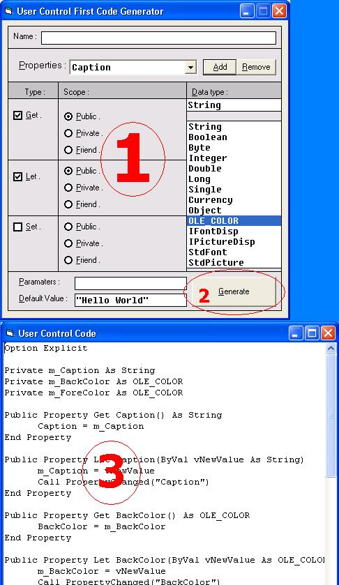



## User Control First Code Generator

### Description

Did you make a usercontrol Before ? if Yes , then i think you got so bored each time you make a new one you have to write codes of properties in various Events .. So i made them to save time and energy and Just enter properties and other options then Click Generate .. You Will see the first code of the UserControl ;) .. Please vote form me ..
 
### More Info
 

             |
---                |---
**Submitted On**   |2003-10-06 18:50:42
**By**             |[Abdalla Mahmoud](https://github.com/Planet-Source-Code/PSCIndex/blob/master/ByAuthor/abdalla-mahmoud.md)
**Level**          |Intermediate
**User Rating**    |5.0 (35 globes from 7 users)
**Compatibility**  |VB 5\.0, VB 6\.0
**Category**       |[Debugging and Error Handling](https://github.com/Planet-Source-Code/PSCIndex/blob/master/ByCategory/debugging-and-error-handling__1-26.md)
**World**          |[Visual Basic](https://github.com/Planet-Source-Code/PSCIndex/blob/master/ByWorld/visual-basic.md)
**Archive File**   |[User\_Contr1654921072003\.zip](https://github.com/Planet-Source-Code/abdalla-mahmoud-user-control-first-code-generator__1-49060/archive/master.zip)

